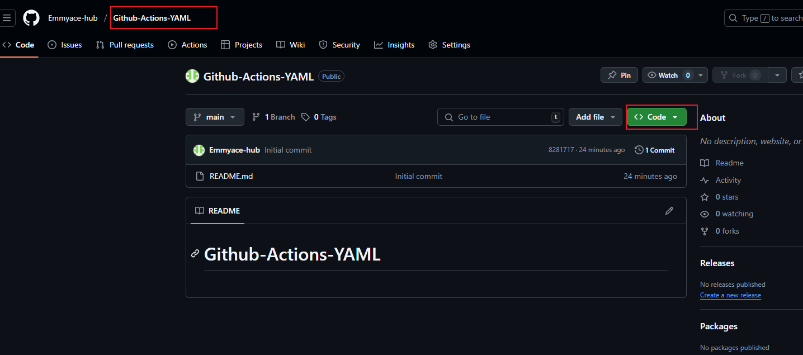
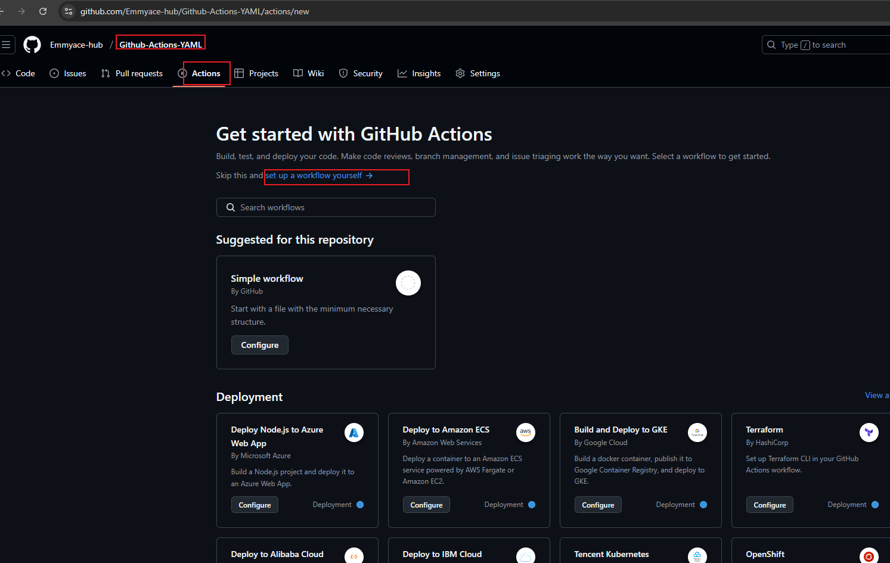
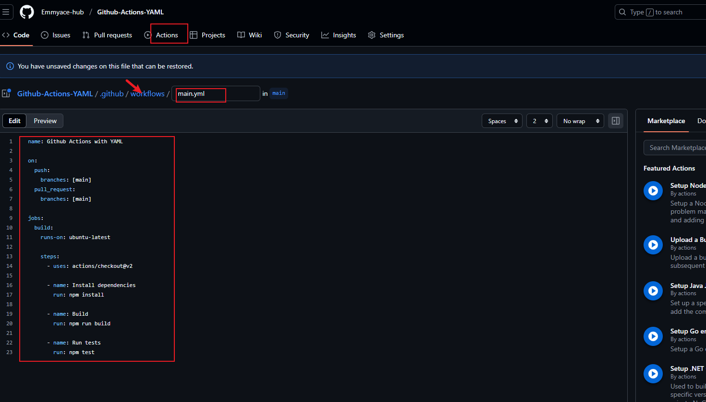
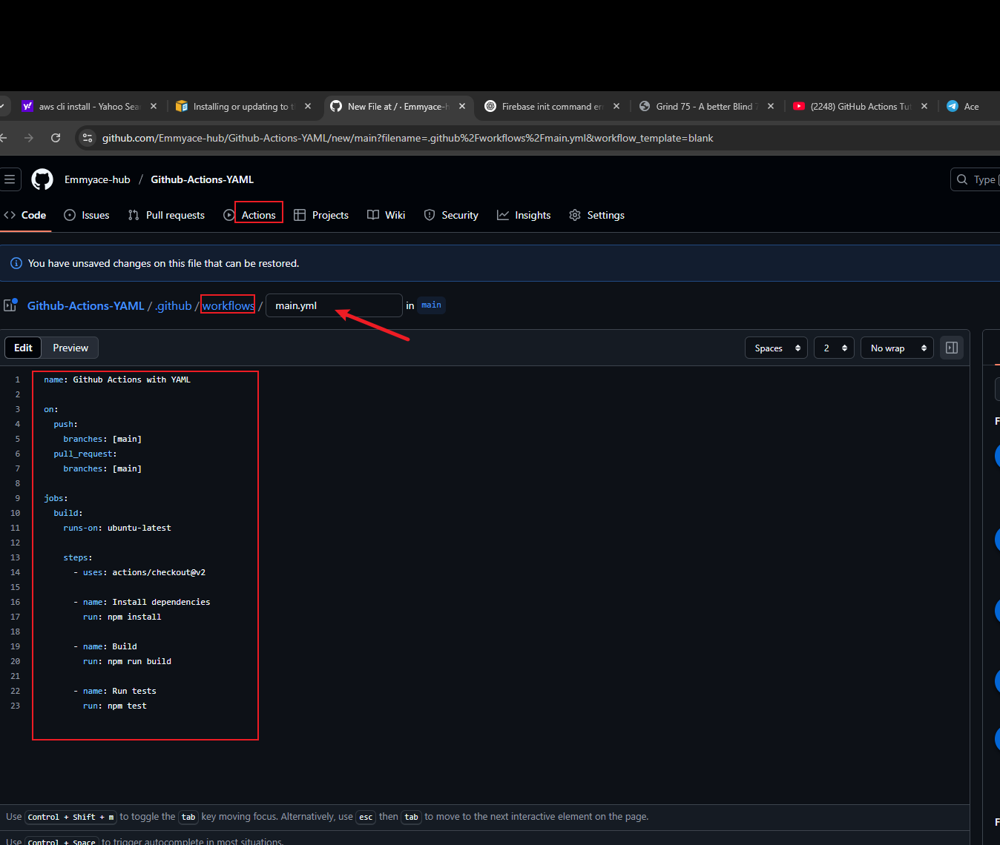
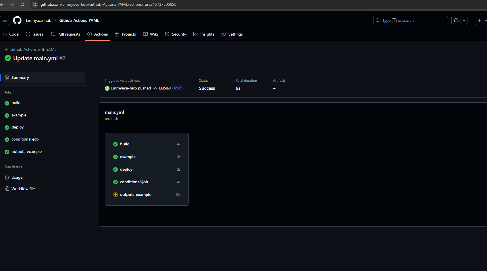

# Github-Actions-YAML

# Set up a Github repository "Github Actions with YAML"

* Create a new repository and clone it to the local repository using the git clone command and the github repository url
    
      git clone https://github.com/Emmyace-hub/Github-Actions-YAML.git

* Go to actions and set up a new workflow "main.yaml" and enter the yaml script to build and test codes

 Define the build job:

        jobs:
        build:
            runs-on: ubuntu-latest
            steps:
            # Steps will be defined next

Adding the build steps:

        steps:
        - uses: actions/checkout@v2
      

        - name: Install dependencies
        run: npm install
       

        - name: Build
        run: npm run build
       

# Running test inthe workflow:

* Adding test step
  
        - name: Run tests
        run: npm test
      
# the final script all together is going to be this for building and testing the code:

    name: Github Actions with YAML

    on:
    push:
        branches: [main]
    pull_request:
        branches: [main]

    jobs:
    build:
        runs-on: ubuntu-latest

        steps:
        - uses: actions/checkout@v2

        - name: Install dependencies
            run: npm install

        - name: Build
            run: npm run build

        - name: Run tests
            run: npm test

* To use an environmental variable:

        env:
        CUSTOM_VAR: value
        # Define an environment variable 'CUSTOM_VAR' at the workflow level.

            runs-on: ubuntu-latest
            steps:
            - name: Use environment variable
                run: echo $CUSTOM_VAR
* Working with secrets:

        runs-on: ubuntu-latest
            steps:
            - name: Use secret
                run: |
                echo "Access Token: ${{ secrets.ACCESS_TOKEN }}"
                # Use 'ACCESS_TOKEN' secret defined in the repository settings.

* Adding conditional execution:

        conditional-job:
            runs-on: ubuntu-latest
            if: github.event_name == 'push' && github.ref == 'refs/heads/main'
            # The job runs only for push events to the 'main' branch.
            steps:
            - uses: actions/checkout@v2
* Using Outputs and inputs betweenn steps:
    outputs-example:

        runs-on: ubuntu-latest
        steps:
        - id: step-one
            run: echo "value=hello" >> $GITHUB_OUTPUT
            # Set an output named 'value' in 'step-one'.
        - id: step-two
            run: |
            echo "Received value from previous step: ${{ steps.step-one.outputs.value }}"

# computing the script to meet all the above configuratioin would be as seen below
        name: Github Actions with YAML

        on:
        push:
            branches: [main]
        pull_request:
            branches: [main]

        env:
        CUSTOM_VAR: value
        # Define an environment variable 'CUSTOM_VAR' at the workflow level.

        jobs:
        build:
            runs-on: ubuntu-latest
            steps:
            - uses: actions/checkout@v2

            # Node.js steps removed because no package.json is present.
            # If you add a package.json, you can restore these steps:
            # - name: Install dependencies
            #   run: npm install

            # - name: Build
            #   run: npm run build

            # - name: Run tests
            #   run: npm test

        example:
            runs-on: ubuntu-latest
            steps:
            - name: Use environment variable
                run: echo $CUSTOM_VAR
                # Access 'CUSTOM_VAR' in a step.

        deploy:
            runs-on: ubuntu-latest
            steps:
            - name: Use secret
                run: |
                echo "Access Token: ${{ secrets.ACCESS_TOKEN }}"
                # Use 'ACCESS_TOKEN' secret defined in the repository settings.

        conditional-job:
            runs-on: ubuntu-latest
            if: github.event_name == 'push' && github.ref == 'refs/heads/main'
            # The job runs only for push events to the 'main' branch.
            steps:
            - uses: actions/checkout@v2

        outputs-example:
            runs-on: ubuntu-latest
            steps:
            - id: step-one
                run: echo "value=hello" >> $GITHUB_OUTPUT
                # Set an output named 'value' in 'step-one'.
            - id: step-two
                run: |
                echo "Received value from previous step: ${{ steps.step-one.outputs.value }}"
                # Access the output of 'step-one'

we can see on the github workflow that it was successfully deployed

